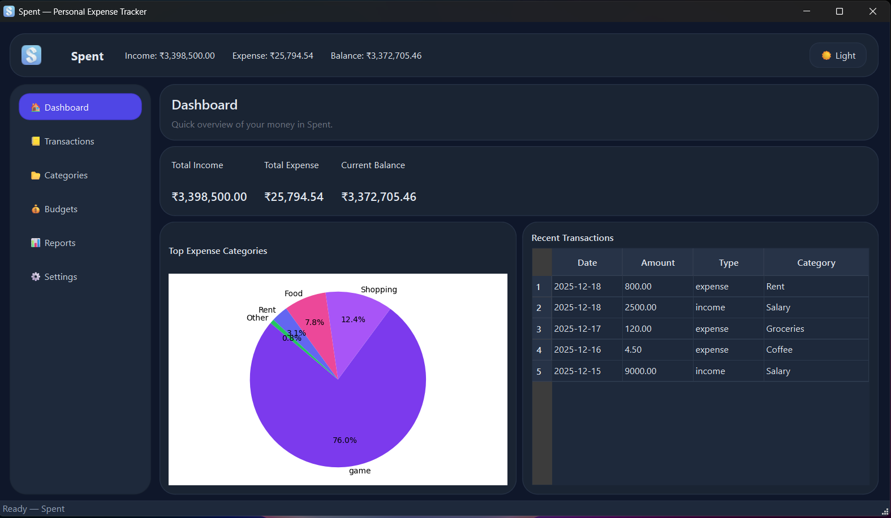

# Spent — Personal Expense Tracker

Spent is a lightweight, local-first desktop application to track personal finances. It provides an intuitive UI for recording transactions, managing budgets and recurring payments, analyzing spending patterns, and importing/exporting your data.

---

## Key Capabilities

Core features
- Add, edit, delete transactions with fields: date, amount, category, payment method, tags, notes.
- Categorization: income vs expense and custom categories.
- Recurring transactions: create, list and delete scheduled payments (weekly/monthly/yearly).
- Budgeting: monthly budgets per category with cycle day and overspend alerts.
- Search & filters: date range, category, type filters.
- Reports & charts: monthly income/expense bar chart, expense-by-category pie chart, balance timeseries.
- Data import/export: CSV and JSON formats.
- Backup & restore: copy/replace the underlying SQLite DB file.
- Basic user settings: currency, start-of-week, start-of-month, theme (light/dark).

Extra features
- Transaction edit & delete actions in the list.
- Seed/demo data script for quick setup.
- Small, embeddable charts powered by Matplotlib or PyQtGraph.

---

## Tech stack
- Python 3.10+
- PySide6 (Qt) for the desktop UI
- SQLAlchemy for the SQLite data layer
- Matplotlib / PyQtGraph for charts
- Pandas (optional helper for CSV/JSON processing)

---

## Installation

Recommended: use a virtual environment.

Windows PowerShell example:

```powershell
python -m venv .venv
.\\.venv\\Scripts\\Activate.ps1
pip install -r requirements.txt
```

Run the app:

```powershell
python app.py
```

Notes:
- On first run the SQLite database `spent.db` will be created in the project root.
- If the UI does not render on WSL, ensure you have a properly configured GUI/X server.

---

## Demo data
To quickly populate the app with sample transactions and budgets run:

```powershell
python scripts/seed_demo.py
```

This will create example transactions, a budget, and a recurring rule so you can explore the UI immediately.

---

## Backup & Data Management
- Export: use Settings → Export CSV/JSON to save transactions.
- Import: use Settings → Import CSV/JSON to load transactions (duplicates may be created if reimported).
- Backup: Settings → Backup DB creates a copy of `spent.db`.
- Restore: Settings → Restore DB replaces the active DB with the selected file.
- Wipe Data: Settings → 🗑 Wipe Data deletes all transactions, budgets and recurring rules (keeps category defaults). Use with caution — this is irreversible.

---

## Screenshots
Place screenshots in the `assets/` directory and reference them here. Example images (not included):

- `assets/screenshot_dashboard.png` — Dashboard with totals and top categories pie chart.
- `assets/screenshot_transactions.png` — Transactions list with filter bar and edit/delete actions.
- `assets/screenshot_reports.png` — Reports page with charts.

You can add images to this section like so:



---

## App logo
The app will display a logo in the header and use it as the window icon if a PNG file exists at `assets/logo.png` (or `logo.png` in the project root). To add your logo, copy a square PNG into `assets/logo.png` and restart the app.

---

## Tests
Basic repository tests are available in the `tests/` folder. Run the test suite with:

```powershell
python -m pytest -q
```

---

## Developer credits
- Author / Maintainer: Arxncodes (Aryan Aditya)
- Contributors: ----

Project structure highlights
- `app.py` — app entrypoint
- `db/` — SQLAlchemy models and repository functions
- `gui/` — PySide6 UI code (pages, forms, dialogs)
- `scripts/seed_demo.py` — quick demo data seeder
- `tests/` — minimal test coverage for repository functions

---

## Contributing
Open issues and pull requests on the source repository. Follow standard Python packaging and testing practices when contributing.

---

## License
Default: MIT-style — add a license file if you need a different license.

If you'd like, I can also add a sample `assets/logo.png` placeholder and example screenshots to make the README visuals complete.

---

## Packaging (Windows)

To build a single-file Windows executable that includes the `assets/logo.png` file, use PyInstaller and pass the logo as an extra data file. On Windows the `--add-data` argument expects a semicolon-separated pair of source and destination. Example (from the project root, using the venv Python):

```powershell
.\.venv\Scripts\python.exe -m PyInstaller --noconfirm --onefile --windowed --name Spent --add-data "assets/logo.png;assets" app.py
```

This creates `dist\Spent.exe`. The runtime will extract bundled data into a temporary folder and your app should load the logo from the `assets` folder (the app already handles the PyInstaller runtime extraction via `sys._MEIPASS`).
